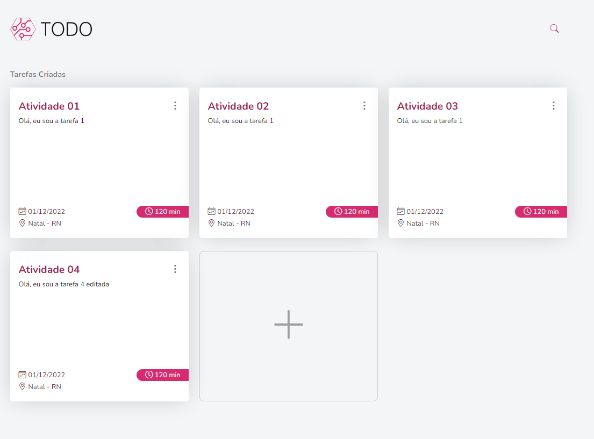
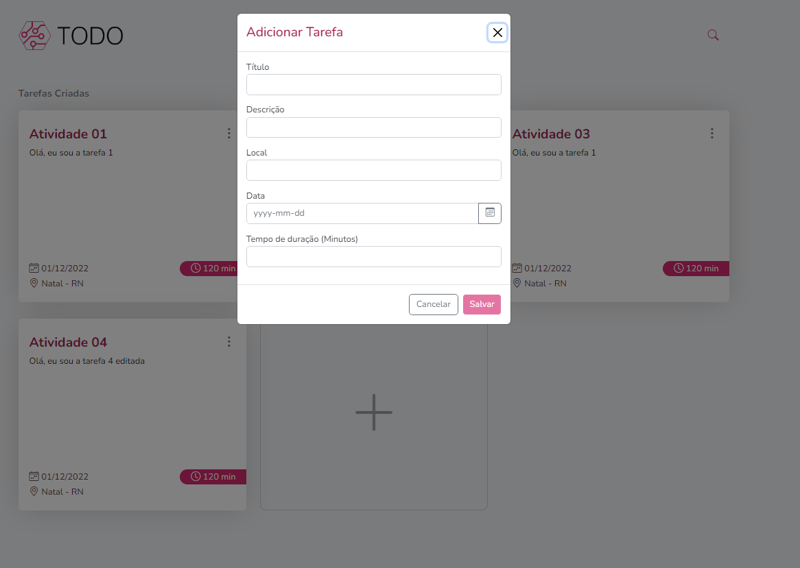

<h1 align="center">
    
</h1>

<h1>
    
</h1>

<h1>
    
</h1>

# Indice

- [Sobre](#-sobre)
- [Tecnologias Utilizadas](#-tecnologias-utilizadas)
- [Como baixar o projeto](#-como-baixar-o-projeto)

## 🔖&nbsp; Sobre

O projeto **TODO WEB** é uma lista de afazeres desenvolvida com o intuito de aprimorar meus conhecimentos dentro do desenvolvimento front-end.

---

## 🚀 Tecnologias utilizadas

O projeto foi desenvolvido utilizando as seguintes tecnologias

- [Angular](https://angular.io)
- [Bootstrap](https://getbootstrap.com/)
- [RxJs](https://rxjs.dev/)

---

## 🗂 Como baixar o projeto

```bash

    # Clonar o repositório
    $ git clone https://github.com/Kl3bs/todo-web.git

    # Entrar no diretório
    $ cd todo-web

    # Instalar as dependências
    $ npm install

```

---

## 💻 Como executar o projeto

**Windows (Json server)**

```bash
	# Iniciando o Json server
    $ npx json-server db.json --routes routes.json

    # Executando o projeto
    $ npx ng s
```

---

**Windows (TODO API)**

Seguir este passo caso queira fazer uso da [API desenvolvida para este projeto](https://github.com/Kl3bs/todo-api).

```bash
	# Executando o projeto
    $ npx ng s
```

---

**MacOS**

Basta seguir os mesmos passos, sem o uso do comando **npx**.
